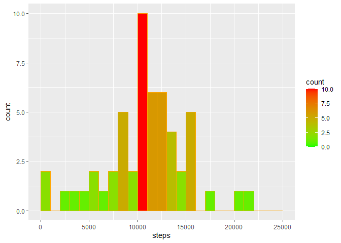

## R Markdown

This is an R Markdown document. Markdown is a simple formatting syntax for authoring HTML, PDF, and MS Word documents. For more details check [weblink](http://rmarkdown.rstudio.com) on using R Markdown 

github repo for Reproducible Research: [RepData_PeerAssessment1](https://github.com/srkthota/RepData_PeerAssessment1)

## Introduction
It is now possible to collect a large amount of data about personal movement using activity monitoring devices such as a Fitbit, Nike Fuelband, or Jawbone Up. These type of devices are part of the “quantified self” movement – a group of enthusiasts who take measurements about themselves regularly to improve their health, to find patterns in their behavior, or because they are tech geeks. But these data remain under-utilized both because the raw data are hard to obtain and there is a lack of statistical methods and software for processing and interpreting the data.

This assignment makes use of data from a personal activity monitoring device. This device collects data at 5 minute intervals through out the day. The data consists of two months of data from an anonymous individual collected during the months of October and November, 2012 and include the number of steps taken in 5 minute intervals each day.
The data for this assignment can be downloaded from the course web site:

The data for this assignment can be downloaded from the course web site:

## Dataset 
[Activity monitoring data](https://d396qusza40orc.cloudfront.net/repdata%2Fdata%2Factivity.zip)


The variables included in this dataset

     •	steps: Number of steps taking in a 5-minute interval (missing values are coded as NA)
     •	date: The date on which the measurement was taken in YYYY-MM-DD format
     •	interval: Identifier for the 5-minute interval in which measurement was taken

The dataset is stored in a comma-separated-value (CSV) file and there are a total of 17,568 observations in this dataset.

## Download the data
     •	Unzip data to obtain a csv file.


```r
#fileUrl <- "https://d396qusza40orc.cloudfront.net/repdata%2Fdata%2Factivity.zip"
#download.file(fileUrl, destfile = paste0(getwd(), '/activity.zip'), method = "curl")
unzip("activity.zip",exdir = ".")
```

## Loading and preprocessing the data

```r
require(data.table,quietly = TRUE)
activity <- read.csv("activity.csv", stringsAsFactors=FALSE,header=TRUE)
str(activity)
```

```
## 'data.frame':	17568 obs. of  3 variables:
##  $ steps   : int  NA NA NA NA NA NA NA NA NA NA ...
##  $ date    : chr  "2012-10-01" "2012-10-01" "2012-10-01" "2012-10-01" ...
##  $ interval: int  0 5 10 15 20 25 30 35 40 45 ...
```

```r
summary(activity)
```

```
##      steps            date              interval     
##  Min.   :  0.00   Length:17568       Min.   :   0.0  
##  1st Qu.:  0.00   Class :character   1st Qu.: 588.8  
##  Median :  0.00   Mode  :character   Median :1177.5  
##  Mean   : 37.38                      Mean   :1177.5  
##  3rd Qu.: 12.00                      3rd Qu.:1766.2  
##  Max.   :806.00                      Max.   :2355.0  
##  NA's   :2304
```

## What is mean total number of steps taken per day?
1. Calculate the total number of steps taken per day


```r
require(dplyr,quietly=TRUE)
TotalSteps <- aggregate(steps ~ date, activity, sum)
StepsPerDay <- tapply(activity$steps, activity$date, sum)
```

2.	If you do not understand the difference between a histogram and a barplot, research the difference between them. Make a histogram of the total number of steps taken each day 


```r
require(ggplot2,quietly = TRUE)
ggplot(data=TotalSteps,aes(steps))+
  geom_histogram(breaks=seq(0,25000,by=1000),
                 col="orange",
                 aes(fill=..count..))+
  scale_fill_gradient("count",low="green",high="red")
```

<!-- -->

3. Calculate and report the mean and median of the total number of steps taken per day

```r
mean(TotalSteps$steps, na.rm = TRUE)
```

```
## [1] 10766.19
```

```r
median(TotalSteps$steps, na.rm = TRUE)
```

```
## [1] 10765
```

## What is the average daily activity pattern?

1. Make a time series plot (i.e.  type = "l") of the 5-minute interval (x-axis) and the average number of steps taken, averaged across all days (y-axis)


```r
#Average steps for each interval for all days
stepsdaysum <- aggregate(steps ~ interval, activity, mean, na.rm = TRUE)

plot(stepsdaysum$interval,
     stepsdaysum$steps, 
     type="l", 
     xlab="Interval", 
     ylab="Number of steps",
     main="Daily activity pattern",col="orange", lwd=2)
abline(h=mean(stepsdaysum$steps, na.rm=TRUE), col="red", lwd=2)
abline(h=median(stepsdaysum$steps, na.rm=TRUE), col="cyan", lwd=2)
```

<!-- -->

2.	Which 5-minute interval, on average across all the days in the dataset, contains the maximum number of steps?


```r
maxInterval<-stepsdaysum[which.max(stepsdaysum$steps),1]
maxInterval
```

```
## [1] 835
```

```r
maxIntervalSteps <-max(aggregate(stepsdaysum$steps, by=list(stepsdaysum$interval), max)[,2])
maxIntervalSteps
```

```
## [1] 206.1698
```


## Imputing missing values

Note 

    There are a number of days/intervals where there are missing values (coded as  NA). The presence of      missing days may introduce bias into some calculations or summaries of the data.

1.	Calculate and report the total number of missing values in the dataset (i.e. the total number of rows with  NAs)


```r
na_number <- sum(is.na(activity$steps)) 
na_number 
```

```
## [1] 2304
```

```r
percentage_na <- mean(is.na(activity$steps)) 
percentage_na
```

```
## [1] 0.1311475
```

2.	Devise a strategy for filling in all of the missing values in the dataset. The strategy does not need to be sophisticated. For example, you could use the mean/median for that day, or the mean for that 5-minute interval, etc.


```r
#Missing values were imputed by inserting the average for each interval
activity.imputed <- transform(activity, 
                      steps = ifelse(is.na(activity$steps), 
                                     stepsdaysum$steps[match(activity$interval,stepsdaysum$interval)], 
                                     activity$steps))
```

3.	Create a new dataset that is equal to the original dataset but with the missing data filled in.


```r
write.table(x = activity.imputed, file = "activityimputed.csv", sep=",",quote = FALSE,row.names = FALSE)
```

4.	Make a histogram of the total number of steps taken each day and Calculate and report the mean and median total number of steps taken per day. Do these values differ from the estimates from the first part of the assignment? What is the impact of imputing missing data on the estimates of the total daily number of steps?


```r
# total number of steps taken per day after imputing missing data
TotalSteps.imputed <- aggregate(steps ~ date, activity.imputed, sum)

#head(TotalSteps.imputed,5)
# mean and median total number of steps taken per day
MeanPerDay.imputed <- mean(TotalSteps.imputed$steps)
MeanPerDay.imputed
```

```
## [1] 10766.19
```

```r
MedianPerDay.imputed <- median(TotalSteps.imputed$steps)
MedianPerDay.imputed
```

```
## [1] 10766.19
```

```r
## Creating the histogram of total steps per day, categorized by data set to show impact
hist(TotalSteps.imputed$steps, breaks=5, xlab="Steps", main = "Total Steps per Day", col="Black")
hist(TotalSteps$steps, breaks=5, xlab="Steps", main = "Total Steps per Day", col="Grey", add=T)
legend("topright", c("Imputed Data", "No Imputed Data"), fill=c("black", "grey") )
```

<!-- -->


## Are there differences in activity patterns between weekdays and weekends?

    For this part the weekdays() function may be of some help here. Use the dataset with the filled-in       missing values for this part.


1.	Create a new factor variable in the dataset with two levels – “weekday” and “weekend” indicating whether a given date is a weekday or weekend day.


```r
weekend <- c("Saturday", "Sunday")
activity.imputed$day <- as.factor(ifelse(is.element(weekdays(as.Date(activity.imputed$date)),
                                                weekend), "Weekend", "Weekday"))
```

2.	Make a panel plot containing a time series plot (i.e.  type = "l") of the 5-minute interval (x-axis) and the average number of steps taken, averaged across all weekday days or weekend days (y-axis). See the README file in the GitHub repository to see an example of what this plot should look like using simulated data.


```r
# Calculate average steps per interval
stepsperIntervalday <- aggregate(steps ~ interval + day, activity.imputed, mean)

#Make a panel plot containing a time series plot
require(lattice,quietly = TRUE)
xyplot(stepsperIntervalday$steps ~ stepsperIntervalday$interval|stepsperIntervalday$day, 
       main="Activity patterns between weekdays and weekends",
       xlab="Interval", 
       ylab="Number of steps",
       layout=c(1,2), 
       type="l",col="orange", lwd=2)
```

<!-- -->
